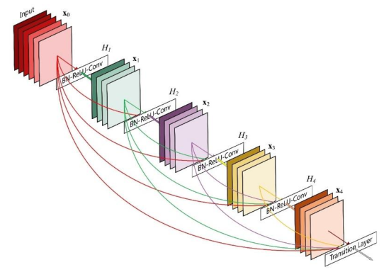
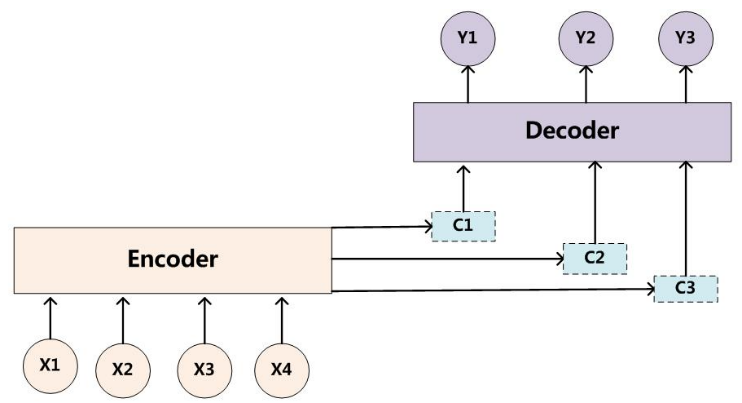

# 特征工程

#### 特征是什么？

特征是数据某些突出性质的表现，是区分数据的关键

#### 如何设计特征？

基于人工经验的特征工程依然是目前的主流

#### 特征选择？

- **过滤式**：方差选择、卡方检验、互信息等。

  优点：计算高效，对于过拟合问题也具有较高的鲁棒性

  缺点：倾向于选择冗余的特征，因为不考虑特征之间的相关性，可能某个特征的分类能力很差，但是它和其它特征组合会得到不错的效果

- **包裹式**：Las Vagas 算法。缺点是消耗资源

- **嵌入式**：基于惩罚项的选择、基于树的选择GBDT

#### 特征归一化原因？

为了消除数据特征之间的量纲影响，使得不同指标之间具有可比性，并且可以提高收敛速度和收敛精度

#### 数值型特征归一化方法？

可以将所有特征都统一到一个大致相同的数值区间内

常用方法有两种：

- **线性函数归一化**：

$$
{X_{norm}} = {{X - {X_{\min }}} \over {{X_{\max }} - {X_{\min }}}}
$$
- **零均值归一化**：

$$
{X_{norm}} = \frac{{X - \mu }}{\sigma }
$$
注意，归一化不是万能的，比如对于决策树模型，就不适用，因为决策树在进行节点分裂时，主要依据特征的信息增益比，归一化不会改变信息增益比

#### 类别特征处理？

常用方法有三种：

- **序号编码**：用于处理类别间具有大小关系的特征，例如高、中、低
- **独热编码**：用于处理类别间不具有大小关系的特征，例如血型
- **二进制编码**：分为两步，先用序号编码赋予每个类别一个类别ID，然后将类别ID对应的二进制编码作为结果

#### 组合特征？

组合特征：把一阶离散特征两两组合，构成高阶组合特征

目的：提高复杂关系的拟合能力

举个例子，比方说浏览新闻，给用户推荐新闻的时候如果按性别或者兴趣这个特征来推，可能效果不是特别好，但是经过观察发现，性别和兴趣有比较强的关系，例如女性可能更喜欢看娱乐类，男性更喜欢体育财经类，把这俩特征做组合加入到模型，效果比单特征要强很多

#### 高维组合特征如何处理？

使用矩阵分解，常用的矩阵分解有：QR分解、LU分解、SVD、Jordan分解

#### 特征相关性计算方法？

Pearson相关系数、Spearman秩相关系数、Kendall相关系数

#### 文本特征表示模型？

- **词袋模型**：词汇需要仔细的设计，特别是为了管理文档的大小，这会影响文档表示的稀疏性；简单但是失去了词的上下文结构
- **N-gram模型**：将连续出现的n个词组成词组作为一个单独的特征放到向量表示中。优点在于它包含了前N-1个词所能提供的全部信息，这些词对于当前词的出现具有很强的约束力。缺点是需要相当规模的训练文本来确定模型的参数。当N很大时，模型的参数空间过大
- **主题模型**：能够计算出每篇文章的主题分布
- **词嵌入模型**：将词映射成K维的向量

#### Word2Vec？

Word2Vec是谷歌2013年提出的最常用的词嵌入模型之一，实际是一种浅层神经网络，具有两种网络结构，CBOW (Continues Bag of Words)和Skip-gram。CBOW的目标是根据上下文出现的词语来预测当前词的生成概率，而Skip-gram是根据当前词来预测上下文中各词的生成概率。CBOW和Skip-gram都可以表示成输入层、映射层、输出层。输入层每个词用独热编码表示，输出层使用Softmax激活函数。训练网络权重，使得语料库中所有单词的整体概率最大化，损失函数一般用交叉熵

#### 数据清洗？

过滤，填补缺失值，处理异常值

#### 缺失值？

如果数据特征的缺失值较多，直接删除该数据

如果缺失不多，可以采用填补法，离散数据用众数、连续数据取平均数

#### 图像分类数据不足如何解决？

主要会带来过拟合问题，即训练集上效果不错，测试集上泛化效果不好

解决方法包括两方面：

- **基于模型**：简化模型、添加正则化项、采用集成学习、Dropout超参数等
- **基于数据**：可以采用数据扩充法，针对图像数据主要有：1、随机旋转、平移、缩放等；2、添加像素噪声扰动；3、颜色变换；4、改变图像亮度、清晰度、对比度等

#### 特征离散化处理好处？

1. 稀疏矩阵计算快，易于模型的快速迭代
2. 简化了模型，相当于降低了过拟合的风险
3. 加强了模型的稳定性、鲁棒性

# 模型评估

#### 机器学习流程？

1. **确定问题**：有监督问题还是无监督问题？回归问题还是分类问题？
2. **数据收集与处理**
3. **特征工程**：包括特征构建、特征选择、特征组合等
4. **模型训练、调参、评估**：包括模型的选择，选择最优的参数
5. **模型部署**：模型在线上运行的效果直接决定模型的成败

 

#### 混淆矩阵？

混淆矩阵，又称误差矩阵，就是分别统计分类模型归错类、归对类的观测值个数，然后把结果放在一个表里展示出来。这个表就是混淆矩阵

|         | 预测 正 | 预测 负 |
| :-----: | :-----: | :-----: |
| 真实 正 |   TP    |   FN    |
| 真实 负 |   FP    |   TN    |

#### 分类模型评估指标？

- **Accuracy（准确率）**：分类正确的样本占总样本个数的比例：

$$
Accuracy = \frac{{{n_{correct}}}}{{{n_{total}}}}{\text{ = }}\frac{{TP + TN}}{{TP + TN + FP + FN}}
$$

缺点： 不同类别的样本比例非常不均衡时，占比大的类别往往成为影响准确率的最主要因素。比如，当负样本占99%时，分类器把所有样本都预测为负样本也可以获得99%的准确率

解决：可以使用每个类别下的样本准确率的算术平均（平均准确率）作为模型评估的指标

- **Precision（精确率）**：分类正确的正样本个数占分类器判定为正样本的样本个数的比例：

$$
Precision = \frac{{TP}}{{TP + FP}}
$$

- **Recall（召回率）**：分类正确的正样本数占真正的正样本个数的比例：

$$
Recall = \frac{{TP}}{{TP + FN}}
$$

- **F1值**：Precision 和 Recall 的调和平均值；当精确率和召回率都高时，F1值也会高：

$$
{\text{F1}} = \frac{{2 \times Precision \times Recall}}{{Precision + Recall}}
$$

- **P-R曲线**：精确率-召回率曲线，横轴是Recall，纵轴是Precision
- **ROC曲线**：受试者工作特征曲线，横轴是假阳性率FPR，纵轴是真阳性率TPR（=Recall）：

$$
\begin{gathered}
  FPR = \frac{{FP}}{N} = \frac{{FP}}{{FP + TN}} \hfill \\
  TPR = \frac{{TP}}{P} = \frac{{TP}}{{TP + FN}} \hfill \\ 
\end{gathered}
$$

​		其中P是真实的正样本的数量，N是真实的负样本的数量

- **绘制ROC方法**：通过不断调整分类器阈值来生成曲线的一组点，再连接所有点得到最终的ROC曲线

- **ROC相比P-R的优势**：当正负样本的分布发生变化时，即样本数量不均衡情况下，P-R曲线会有明显变化，而ROC曲线一般没有明显变化。这使得ROC能够降低不同测试集带来的干扰，更加客观地衡量模型本身的性能
- **AUC**：ROC曲线下的面积大小
- **AUC计算方法**：沿着ROC横轴积分。AUC取值一般在0.5~1之间。AUC越大，分类性能越好。AUC表示预测的正例排在负例前面的概率

 

#### 余弦距离？和欧氏距离区别？

两个向量A和B的余弦距离等于1 - 余弦相似度：

$$
Dis(A,B) = 1 - \cos (A,B) = 1 - \frac{{AB}}{{\left\| A \right\|\left\| B \right\|}}
$$
余弦距离体现方向上的相对差异，而欧氏距离体现的是数值上的绝对差异

余弦距离不是一个严格意义的距离，满足正定性、对称性，但不满足三角不等式，例如当A=(0,1)，B=(1,1)，C=(0,1)时，Dis(A,B) + Dis(B,C) < Dis(A,C)

 

#### 损失函数？

- **0-1损失函数**：非凸、非光滑

$$
L(f(x),y) = \left\{ {\begin{array}{*{20}{l}}
  {1,}&{y \ne f(x)} \\ 
  {0,}&{y = f(x)} 
\end{array}} \right.
$$

- **绝对损失函数**：优点是异常点多的情况下鲁棒性好；缺点是不方便求导

$$
L(f(x),y) = |f(x) - y|
$$

- **平方损失函数**：优点是求导方便，能够用梯度下降法优化；缺点是对异常值敏感

$$
L(f(x),y) = {(f(x) - y)^2}
$$

- **交叉熵损失函数**：

$$
L(f(x),y) =  - \sum\limits_{k = 1}^K {{y_k}\ln {f_k}(x)}
$$

- **对数似然损失函数**：

$$
L(P(Y|X),Y) =  - {\text{log}}P(Y|X)
$$

- **Huber 损失函数**：结合了绝对损失函数和平方损失函数的优点；缺点是需要调整超参数   

$$
L(f(x),y) = \left\{ {\begin{array}{*{20}{l}}
  {{{(f(x) - y)}^2}}&{|f(x) - y| \leqslant \delta } \\ 
  {2\delta |f(x) - y| - {\delta ^2}}&{|f(x) - y| > \delta } 
\end{array}} \right.
$$

- **Log-Cosh 损失函数**：具有Huber的所有优点，同时二阶处处可微（牛顿法要求二阶可微）

$$
L(f(x),y) = \log \cosh (f(x) - y)
$$

#### 经验误差、结构误差、泛化误差？

- 经验误差：又称经验损失或经验风险，指模型关于训练数据集的平均损失

- 结构误差：又称结构损失或结构风险，是在经验误差上加上正则化项

- 泛化误差：模型在测试集上的平均损失

#### 泛化能力？

泛化能力指模型对未知数据的预测能力

 

#### 模型检验？

- **留出法（Holdout）**：将原始数据集随机分为训练集和验证集。优点是简单，缺点是在验证集上计算的评估指标与数据集划分有很大关系
- **交叉验证**：将原始数据集分为K个大小相等的子集，每次使用一个子集作为验证集来评估模型，其余子集用作训练集来训练模型，最后把K次评估指标的平均值作为最终评估指标
- **自助法（Bootstrap）**：对总数为n的数据集，进行n次有放回的随机抽样，得到大小为n的训练集，没有被抽出的样本作为验证集。当n趋于无穷大时，约有1/e=36.8%的样本未被抽出

 

#### 模型选择？

- 正则化
- 交叉验证

#### 超参数调优？

- **网格搜索**：在搜索范围内以特定步长进行搜索。优点是简单，缺点是耗时，当目标函数非凸时容易错过全局最优
- **随机搜索**：在搜索范围内随机选择参数值进行搜索。优缺点同网格搜索
- **贝叶斯优化搜索**：通过学习目标函数的形状，找到向全局最优提升的参数。优点是考虑了前几次搜索结果，缺点是容易陷入局部最优

 

#### 解决类别不平衡？

- **欠采样**：去除一些数量较多的类别中的数据。
- **过采样**：增加一些数量较少的类别中的数据。
- **阈值移动**

 

#### 过拟合 vs 欠拟合？

**过拟合**：模型对训练数据拟合较好，但在测试集上表现不好

**欠拟合**：模型在训练和测试都表现不好

|                          过拟合解决                          |                    欠拟合解决                    |
| :----------------------------------------------------------: | :----------------------------------------------: |
| 提高样本数量 简化模型 加入正则化项或提高正则化系数 神经网络Dropout、Early Stopping等 决策树剪枝、限制树的深度 使用集成学习 | 增加特征 增加模型复杂度 减小正则化系数 |

 

#### 偏差 vs 方差？

- **高偏差对应于模型的欠拟合**：模型过于简单，以至于未能很好的学习训练集，从而使得训练误差过高
- **高方差对应于模型的过拟合**：模型过于复杂，以至于将训练集的细节都学到，将训练集的一些细节当做普遍的规律，从而使得测试集误差与训练集误差相距甚远

 

#### 监督学习三个重要问题？

- 分类
- 标注：可看作分类的推广，输入是一个观测序列，输出是一个标注序列或状态序列
- 回归

#### 无监督学习三个重要问题？

- 聚类
- 降维
- 概率估计

#### 线性模型 vs 非线性模型？

如果函数 y=f(x) 是线性函数，则称模型是线性模型，否则称模型为非线性模型

|                           线性模型                           |               非线性模型                |
| :----------------------------------------------------------: | :-------------------------------------: |
| 线性回归、逻辑回归 线性SVM K近邻 K-means 朴素贝叶斯NB 潜在语义分析LSA | 核函数SVM AdaBoost 神经网络NN |

#### 生成式模型 vs 判别式模型？

- 生成模型学习联合概率分布 P(X,Y)，然后根据先验概率 P(X) 求出条件概率分布 P(Y|X)：

$$
P(Y|X) = \frac{{P(X,Y)}}{{P(X)}}
$$

- 判别模型由数据直接学习决策函数 f(X) 或条件概率分布 P(Y|X)

|                           生成模型                           |                           判别模型                           |
| :----------------------------------------------------------: | :----------------------------------------------------------: |
| 朴素贝叶斯NB、贝叶斯网络 隐马尔可夫模型HMM、马尔可夫随机场MRF 高斯混合模型GMM 概率潜在语义分析pLSA 隐含狄利克雷分配LDA | 线性回归、逻辑回归 SVM K近邻 决策树 最大熵模型、条件随机场CRF |

 

#### 概率模型 vs 非概率模型？

区别在于模型的内在结构，概率模型一定可以表示为联合概率分布的形式，而非概率模型则不一定存在这样的联合概率分布

|                           概率模型                           |                          非概率模型                          |
| :----------------------------------------------------------: | :----------------------------------------------------------: |
| 决策树 朴素贝叶斯NB 隐马尔可夫模型HMM 高斯混合模型GMM 条件随机场CRF 概率潜在语义分析pLSA 隐含狄利克雷分配LDA | SVM K近邻 K-means AdaBoost 潜在语义分析LSA 神经网络NN |

逻辑回归即可看作概率模型，又可看作非概率模型

 

#### 参数化模型 vs 非参数化模型？

- 参数化模型假设模型参数的维度固定，模型可以由有限维参数完全刻画
- 非参数模型假设模型参数的维度不固定或者说无穷大，随着训练数据量的增加而不断增大

|                          参数化模型                          |                         非参数化模型                         |
| :----------------------------------------------------------: | :----------------------------------------------------------: |
| 朴素贝叶斯NB 线性回归、逻辑回归 K-means 高斯混合模型GMM | 决策树 SVM AdaBoost K近邻 潜在语义分析LSA 概率潜在语义分析pLSA 隐含狄利克雷分配LDA |

 

#### R方？

R方也叫确定系数（coefficient of determination），表示模型对测试数据拟合的程度，值越接近于1，效果越好

$$
{R^2} = 1 - \frac{{\sum\limits_{i = 1}^m {{{({y_i} - f({x_i}))}^2}} }}{{\sum\limits_{i = 1}^m {{{({y_i} - \bar y)}^2}} }},\;\;\;\;\;\;\;\;\;\bar y = \frac{1}{m}\sum\limits_{i = 1}^m {{y_i}}
$$

#### L1 vs L2？

+ L1 范数: 向量各个元素绝对值之和，可以使权值参数稀疏，方便特征提取
+ L2 范数: 向量各个元素平方和的开方，又称 Euclidean 范数或 Frobenius 范数，可以防止过拟合，提升模型的泛化能力

# 线性回归和逻辑回归

#### 线性回归？

线性回归是一种预测模型，利用各个特征值去预测目标值

**主要思想**：通过是给每个特征分配一个权重，最终预测结果是每个特征值与权重的乘积之和再加上偏置

**训练目标**：找到各个特征的最佳权重和偏置，使得误差最小

**假设前提**：特征与预测值呈线性关系，噪声（误差）符合正态分布

 

#### 线性回归公式？

$$
f(x) = {\omega ^{\text{T}}}x + b
$$

#### 线性回归损失函数？

均方误差MSE：

$$
\sum\limits_{i = 1}^m {{{(f(x) - y)}^2}}
$$

#### 线性回归求解方法？

最小二乘法（基于MSE最小化的求解方法）。具体实现包括：

- **公式法**：损失对w和b进行求导，导数为0，然后求解w和b。（需要是满秩矩阵，样本数量要大于特征数量）
- **优化法**：初始化w和b，然后使用优化方法不断进行优化求解，如梯度下降法

 

#### 线性回归拟合不好的原因？

- 数据不符合线性回归的假设
- 普通线性回归容易过拟合，可以尝试使用Lasso回归或者Ridge回归

 

#### Lasso回归 vs Ridge回归?

- **Lasso回归**：指加入L1正则化项的线性回归，会产生稀疏参数，大多数回归系数会变成0，模型只会保留一小部分特征

$$
\sum\limits_{i = 1}^m {{{(f(x) - y)}^2}}  + \lambda \sum\limits_{i = 1}^m {\left| {{\omega _i}} \right|} 
$$
- **Ridge回归**：指加入L2正则化项的线性回归，通过放弃最小二乘法的无偏性，以损失部分信息、降低精度为代价获得回归系数更为符合实际、更可靠的回归方法

$$
\sum\limits_{i = 1}^m {{{(f(x) - y)}^2}}  + \lambda \sum\limits_{i = 1}^m {\omega _i^2}
$$
它们都可用于解决普通线性回归的过拟合问题。如果样本特征存在明显稀疏线性关系时，使用Lasso回归，否则使用Ridge回归

 

#### 线性回归因变量（真实的y）服从正态分布？

因为线性回归的假设前提是特征与预测值呈线性关系，噪声符合正态分布，那么因变量也符合分布

 

#### 判断数据符合正态分布方法？转换？

看峰度和偏度。若偏度大于3倍标准差，则需要进行处理，可以进行对数变换

 

#### 广义线性模型？

$$
f(x) = g({\omega ^{\text{T}}}x + b)
$$

其中要求g是单调可微函数

 

#### 逻辑回归？ 

逻辑回归假设数据服从伯努利分布，通过极大似然函数法，运用梯度下降来求解参数，来达到将数据二分类的目的

 

#### 逻辑回归公式？

$$
f(x) = {\text{sigmoid}}({\omega ^{\text{T}}}x + b) \quad\quad \text{或} \quad\quad \ln \frac{{f(x)}}{{1 - f(x)}} = {\omega ^{\text{T}}}x + b
$$

#### 逻辑回归的损失函数？

最大化极大似然函数，即最小化以下式子：

$$
- \ln f(x) =  - \sum\limits_{i = 1}^m {[{y_i}\ln f({x_i}) + (1 - y)\ln (1 - f({x_i}))]}
$$

#### 逻辑回归不用平方损失？ 

因为极大似然函数形式能保证损失函数的梯度与sigmoid函数本身的梯度无关，这样梯度更新速度比较稳定

 

#### 逻辑回归假设？

- 假设数据服从伯努利分布

- 假设正类的概率由sigmoid的函数计算

#### 逻辑回归优缺点？

- 优点：形式简单、训练速度快、占用内存小

- 缺点：准确率不高、难以处理数据类别不平衡问题、无法筛选特征

#### 逻辑回归目的？

进行数据二分类。输出值是一个连续变量，通常可以划定一个阈值，输出大于该阈值被划分为正类、小于为负类，一般选择0.5作为阈值

 

#### 逻辑回归很多特征高度相关或重复多遍的影响？

在损失函数最终收敛的情况下，就算有很多特征高度相关也不会影响分类器的效果

 

#### 逻辑回归去掉高度相关特征？

- 加强模型的可解释性

- 大大提高训练速度

 

#### 逻辑回归处理多分类？

将sigmoid激活函数换成softmax激活函数

 

#### 逻辑回归 vs 线性回归？

不同：

- 逻辑回归用于分类，线性回归用于回归

- 逻辑回归的因变量是离散的，线性回归的因变量是连续的

相同：

- 都使用了极大似然估计来对训练样本进行建模

- 都可以使用梯度下降求解

#### 逻辑回归 vs 广义线性模型？

逻辑回归可以看作广义线性模型在因变量（真实的y）服从伯努利分布时的一个特殊情况

 

# SVM

#### SVM原理？

SVM是一种二类分类模型，它的基本模型是定义在特征空间的间隔最大的线性分类器，SVM的学习策略是间隔最大化

- 当训练数据线性可分，通过硬间隔最大化，学习一个线性的分类器
- 当训练数据近似线性可分，通过软间隔最大化，学习一个线性的分类器
- 当训练数据线性不可分，通过使用核技巧及软间隔最大化，学习非线性分类器

 

#### SVM推导?

给定样本集大小为 $m$ 的样本集 $D = \{ ({x_i},{y_i})\} ,\;i = 1,2, \cdots,m$，其中 ${y_i} \in \{  - 1,1\}$ ，对于划分超平面 ${\omega ^{\text{T}}}x + b = 0$，目标是使得对于所有样本点：

$$
\left\{ {\begin{array}{*{20}{c}}
  {{\omega ^{\text{T}}}{x_i} + b \geqslant 1,\;\;\;{y_i} = 1} \\ 
  {{\omega ^{\text{T}}}{x_i} + b \leqslant  - 1,\;\;\;{y_i} =  - 1} 
\end{array}} \right.
$$
即最大化两个异类支持向量到超平面得距离和 $\frac{2}{{\left\| \omega\right\|}}$，等价于最小化 $\frac{1}{2}{\left\| \omega \right\|^2}$

于是SVM的基本型为：

$$
\begin{gathered}
  \mathop {\min }\limits_{\omega ,b} \;\frac{1}{2}{\left\| \omega  \right\|^2} \hfill \\
  s.t.\;\;\;\;{y_i}({\omega ^{\text{T}}}{x_i} + b) \geqslant 1,\;i = 1,2, \cdots ,m \hfill \\ 
\end{gathered} 
$$
这是一个凸二次优化问题，可应用拉格朗日对偶性求解它的对偶问题：

$$
\mathop {\max \;}\limits_{\omega ,b} L(\omega ,b,\alpha ) = \frac{1}{2}{\left\| \omega  \right\|^2} + \sum\limits_{i = 1}^m {{\alpha _i}(1 - {y_i}({\omega ^{\text{T}}}{x_i} + b))} 
$$
令 $L(\omega ,b,\alpha )$ 对 $\omega$ 和 $b$ 求偏导为0得：

$$
\begin{gathered}
  \omega  = \sum\limits_{i = 1}^m {{\alpha _i}{y_i}{x_i}}  \hfill \\
  \sum\limits_{i = 1}^m {{\alpha _i}{y_i} = 0}  \hfill \\ 
\end{gathered}
$$
代入得对偶问题：

$$
\begin{gathered}
  \mathop {\max \;}\limits_{\omega ,b} \sum\limits_{i = 1}^m {{\alpha _i}}  - \frac{1}{2}\sum\limits_{i = 1}^m {\sum\limits_{j = 1}^m {{\alpha _i}{\alpha _j}{y_i}} } {y_j}x_i^{\text{T}}{x_j} \hfill \\
  s.t.\;\;\;\sum\limits_{i = 1}^m {{\alpha _i}{y_i} = 0}  \hfill \\
  \;\;\;\;\;\;{a_i} \geqslant 0,\;\;i = 1,2, \cdots ,m \hfill \\ 
\end{gathered}
$$
解出 $\alpha$ 后，求得 $\omega$ 和 $b$ 即可达到模型：

$$
f(x) = \text{sign}({\omega ^{\text{T}}}x + b) = \text{sign}\left(\sum\limits_{i = 1}^m {{\alpha _i}{y_i}x_i^{\text{T}}x + b}\right)
$$

#### 软间隔SVM？

引入松弛变量 $\xi$，允许一定程度错分类，优化问题写为：

$$
\begin{gathered}
  \mathop {\min }\limits_{\omega ,b} \;\frac{1}{2}{\left\| \omega  \right\|^2} + C\sum\limits_{i = 1}^m {{\xi _i}}  \hfill \\
  s.t.\;\;\;\;{y_i}({\omega ^{\text{T}}}{x_i} + b) \geqslant 1 - {\xi _i} \hfill \\
  \;\;\;\;\;\;\;\;{\xi _i} \geqslant 0,\;\;\;\;i = 1,2, \cdots ,m \hfill \\ 
\end{gathered}
$$

#### 核SVM？

$x_i^T{x_j}$ 拓展为核函数 $k({x_i},{x_j})$：

$$
\begin{gathered}
  \mathop {\max \;}\limits_{\omega ,b} \sum\limits_{i = 1}^m {{\alpha _i}}  - \frac{1}{2}\sum\limits_{i = 1}^m {\sum\limits_{j = 1}^m {{\alpha _i}{\alpha _j}{y_i}} } {y_j}k(x_i^{},{x_j}) \hfill \\
  s.t.\;\;\;\sum\limits_{i = 1}^m {{\alpha _i}{y_i} = 0}  \hfill \\
  \;\;\;\;\;\;{a_i} \geqslant 0,\;\;i = 1,2, \cdots ,m \hfill \\ 
\end{gathered}
$$

#### SVM损失函数？

SVM的损失函数就是合页损失函数（Hinge Loss）加上正则化项：

$$
\mathop {\min }\limits_{\omega ,b} \;\;\frac{1}{2}{\left\| \omega  \right\|^2}\; + \;C\;\sum\limits_{i = 1}^m {\max (0,1 - {y_i}({\omega ^{\text{T}}}{x_i} + b))}
$$
前一项为正则化项，后一项为合页损失函数

 

#### 核函数有哪些？

- **线性核函数**：主要用于线性可分的情形，参数少，速度快，对于一般数据，分类效果已经很理想了
- **多项式核函数**
- **高斯核函数**：主要用于线性不可分的情形，参数多，分类结果非常依赖于参数
- **sigmoid核函数**

 

#### 核函数作用？

核函数把低维空间映射到高维空间，将低维空间线性不可分的两类数据变成高维空间线性可分的

 

#### 核函数选择？

- 样本数量多，或特征多时，用线性核

- 样本数量不多，特征少时，使用高斯核

#### SVM为什么用对偶函数求解？

- 对偶将原始问题的约束转为对偶问题的等式约束，方便了核函数的引入

- 对偶改变了SVM问题的复杂度，在原始问题下，求解问题的复杂度与样本的特征维度有关，在对偶问题下，与支持向量的数量有关

#### SVM和全部数据还是局部数据有关?

SVM只和分类界限上的支持向量点有关，换而言之只和局部数据有关

 

#### 高斯核为什么能拟合无穷维度? 

因为将泰勒展式代入高斯核，将会得到一个无穷维度的映射

 

#### SVM为什么会对缺失值敏感？

这里的缺失值是指缺失某些特征数据。SVM没有处理缺失值的策略，缺失值会对训练结果好坏造成很大影响

 

#### SVM属于线性模型还是非线性模型？

SVM基本模型是一个线性分类器；而使用核函数的SVM可以处理非线性问题

 

#### SVM 为什么采用间隔最大化？

- 一方面，当训练数据线性可分时，存在无穷个超平面可以将两类数据正确分开，而利用间隔最大化求得的最优超平面是唯一的

- 另一方面，间隔最大化求得的超平面所产生的分类结果是最鲁棒的，对未知数据泛化能力最强

#### SVM为什么可以分类非线性问题？

因为SVM可以通过核技巧，完成非线性映射，将原空间映射到更高维空间，使得原空间的非线性问题变成高维空间的的线性可分问题

 

#### 训练误差为0的SVM一定存在吗？

一定存在。证明详见百面P55

 

#### 软间隔SVM训练误差可以为0吗？ 

不一定。实际应用中，如果使用SMO算法训练，并不一定得到训练误差为0的模型，因为软间隔SVM的优化目标有两项：$C\sum\limits_{i = 1}^m {{\xi _i}}$ 和 $\frac{1}{2}{\left\| \omega\right\|^2}$，当惩罚系数 $C$ 选取较小值时，后一项（正则项）将占据优化的主要比重，使得一个带有训练误差、较小的 $\omega$ 也可能成为最优结果。例如，当 $C = 0$ 时，$\omega = 0$ 也可以达到优化目标，但此时显然训练误差不为0

 

#### SVM处理多分类？

可以使用一对多分类技巧，即对于k分类问题，训练k个SVM分类器，每个SVM输出是否属于某一类

 

#### SVM的SMO求解算法？

SMO（序列最小优化）是一种启发式算法，用于SVM快速求解，其特点是不断将原二次规划问题分解为只有两个变量的二次规划子问题，求出子问题的解析解，直到所有变量满足KKT条件为止，此时该最优化问题的解即被求出

因为子问题有解析解，所以每次计算子问题都很快，虽然计算子问题次数很多，但总体上还是高效的

  

# PCA和LDA

#### 降维目的？

- 能够减少变量个数，降低算法运算开销，过多的变量会妨碍查找规律的建立

- 能够确保这些变量是相互独立

- 存在多重共线性的变量会导致解空间的不稳定

- 高维空间本身具有稀疏性

#### 主成分分析PCA原理？

PCA将高维数据通过线性变换投影到低维空间上，旨在找到数据中的主成分，利用主成分表征原始数据，达到降维目的

 

#### PCA目标函数？

最大化投影方差。因为方差越大的方向代表信息量越大

 

#### PCA步骤？

假设有 $m$ 条 $n$ 维属性的数据，对每条数据按列排（即转置）得到矩阵 $X$ ，$X$  的形状 $n\times m$

- 中心化：对 $X$ 每一行（代表一个特征字段）进行零均值化，即减去行均值

- 计算协方差矩阵：$C{\text{ = }}\frac{1}{m}X{X^{\text{T}}}$  ，$C$ 的形状 $n \times n$

- 计算 $C$ 的特征值和对应的特征向量

- 按特征值大小将特征向量从上到下按行排列成矩阵，取前 $k$ 行组成矩阵 $P$， $P$ 的形状 $k \times n$

- $Y = PX$ 即为降到 $k$ 维后的数据，$Y$ 形状 $k \times m$

#### 主成分是什么？

协方差矩阵的最大的前 $k$ 个特征值对应的特征向量

 

#### PCA有哪些优点和缺点？如何优化？

优点：

- 主要是矩阵特征值分解，计算简单，易于实现

- 各主成分相互正交，可消除原始数据的多重共线性

缺点：

- 无法进行非线性降维，优化：使用核主成分分析KPCA

- 无监督，没有考虑数据的标签，只是把数据映射到方差比较大的方向，优化：使用有监督的降维方法LDA

#### 线性判别分析LDA原理？

将带标签的数据投影到低维空间，使得投影后的数据类内距离最小而类间距离最大

#### LDA优缺点？

优点：有监督，以类别衡量差异性，既可以用于降维，也可以用为分类

缺点：最多只能降到类别数减一维，不适用非高斯分布的数据，可能过拟合

 

#### PCA vs LDA？

|      |                             PCA                              |                             LDA                              |
| :--: | :----------------------------------------------------------: | :----------------------------------------------------------: |
| 相同 |   都可降维 都使用矩阵分解 都假设数据服从高斯分布   |                                                              |
| 不同 | 无监督 降维多少无限制 只能降维 选择方差最大的投影方向 | 有监督 最多降到类别减一维 即可降维，又可分类 选择分类最好的投影方向 |

 

# KNN

#### KNN原理？

输入一个样本点，计算所有样本到该样本点的欧式距离，取前K个进行决策

三个要素：

- **欧式距离**：判断类别远近
- **K值**：过小易过拟合，过大易欠拟合
- **决策方式**：分类：投票法、带权投票法；回归：平均法、带权平均法

 

#### 什么时候用KNN？

当特征与类别之间的关系比较复杂，且数据量比较大时

 

#### 怎么选K值？

实际中，一般选一个比较小的K值，可用交叉验证法来选择最优的K值

 

#### KNN优缺点？

|                             优点                             |                             缺点                             |
| :----------------------------------------------------------: | :----------------------------------------------------------: |
| 思想简单，能分类也能回归 懒惰学习，无需训练 可用于非线性分类 对异常点不敏感 和朴素贝叶斯法相比，对数据没有假设，泛化误差不超过贝叶斯最优分类器的两倍 | 计算量大 样本不平衡的时候，对稀有类别的预测准确率低 KD树、球树之类的模型建立需要大量的内存 |

 

#### KD树？

KD树是一种划分空间的平衡二叉树，不断用垂直于坐标轴的超平面将K维空间不断二分，构成一系列K维超矩形区域。搜索时，不断进行分支判断，选择一个K维超矩形区域

举例：对数据集 $X = \{(2,3), (5,4), (9,6), (4,7), (8,1), (7,2)\}$ 进行划分，交替选择坐标轴中位数数据点进行划分，结果如下：

 

# 决策树

#### 决策树？

决策树算法，本质是对样本数据进行树形分类的过程，目的是为了让模型的不确定性降低地越快越好

基于其评价指标的不同，主要有ID3算法、C4.5算法、CART算法，其中ID3算法的评价指标是信息增益，C4.5算法的评价指标是信息增益率，CART算法的评价指标是基尼系数

 

#### 决策树建树过程？

主要包含三个步骤：特征选择、树的构造、树的剪枝

 

#### 决策树的启发函数？

常用的决策树算法有ID3、C4.5、CART，它们的启发函数如下：

- **ID3——最大信息增益**

首先，对于给定样本集 $D$，类别总数为 $K$，其信息熵定义为：

$$
H(D) =  - \sum\limits_{k = 1}^K {\frac{{\left| {{C_k}} \right|}}{{\left| D \right|}}} {\log _2}\frac{{\left| {{C_k}} \right|}}{{\left| D \right|}}
$$
其中，$C_k$是 $D$ 中属于第 $k$ 类的样本子集

然后，计算某个特征 $A$ 对于 $D$ 的条件熵：

$$
H(D|A) = \sum\limits_{i = 1}^n {\frac{{\left| {{D_i}} \right|}}{{\left| D \right|}}H({D_i}) = } \sum\limits_{i = 1}^n {\frac{{\left| {{D_i}} \right|}}{{\left| D \right|}}\left( { - \sum\limits_{k = 1}^K {\frac{{\left| {{D_{ik}}} \right|}}{{\left| {{D_i}} \right|}}{{\log }_2}\frac{{\left| {{D_{ik}}} \right|}}{{\left| {{D_i}} \right|}}} } \right)}
$$
其中，$D_i$ 是 $D$ 中特征 $A$ 取第 $i$ 个值的样本子集，$D_{ik}$ 表示 $D_i$ 中属于第 $k$ 类的样本子集

于是，特征A的信息增益 $Gain(D,A)$ 表示为熵与条件熵的差值（也叫做互信息）：

$$
Gain\;(D,A) = H(D) - H(D,A)
$$
ID3每次选择信息增益最大的特征对样本集进行划分。信息增益准则可能对取值数目多的特征有偏好

- **C4.5——最大信息增益率**

信息增益率定义为：

$$
Gain\_ratio\;(D,A) = \frac{{Gain\;(D,A)}}{{IV(A)}}
$$
其中，$IV(A)$ 称为特征 $A$ 的取值熵：

$$
IV(A) =  - \sum\limits_{i = 1}^n {\frac{{\left| {{D_i}} \right|}}{{\left| D \right|}}{{\log }_2}} \frac{{\left| {{D_i}} \right|}}{{\left| D \right|}}
$$
$IV(A)$ 目的是对偏好于特征取值多的信息增益进行平衡 

C4.5每次选择增益率最大的特征对样本集进行划分，由于增益率准则对取值少的特征有偏好，故C4.5在实际使用时，一般先从侯选属性中筛选出信息增益大于平均水平的属性，再从中选择增益率最高的 

- **CART——最小基尼指数**

基尼指数定义为：

$$
Gini(D) = 1 - \sum\limits_{k = 1}^K {{{\left( {\frac{{\left| {{C_k}} \right|}}{{\left| D \right|}}} \right)}^2}}
$$
本质是连续两次随机抽取的样本属于不同类别的概率，值越小，样本纯度越高

特征 $A$ 的基尼指数为：

$$
Gini\;(D,A) = \sum\limits_{i = 1}^n {\frac{{\left| {{D_i}} \right|}}{{\left| D \right|}}Gini\;({D_i}) = } \sum\limits_{i = 1}^n {\frac{{\left| {{D_i}} \right|}}{{\left| D \right|}}\left( {1 - \sum\limits_{k = 1}^K {{{\left( {\frac{{\left| {{D_{ik}}} \right|}}{{\left| {{D_i}} \right|}}} \right)}^2}} } \right)}
$$
CART每次选择基尼指数最小的特征对样本集进行划分，需要注意的是，CART采用的是二元切分法，即 $n=2$，对于取值数目 $n>2$ 的特征，处理办法是每次挑选一个取值作为切分点，在该特征上进行 “是该取值” 或 “非该取值“ 二元划分，遍历该特征所有取值，选择具有最小基尼系数的切分点，并将该最小基尼系数作为该特征的基尼系数

 

#### 决策树优缺点？

|                             优点                             |                             缺点                             |
| :----------------------------------------------------------: | :----------------------------------------------------------: |
| 计算简单、速度快 可解释性强 比较适合处理有缺失属性的样本 | 容易发生过拟合 忽略了数据之间的相关性 信息增益偏向具有更多数值的特征 |

 

#### ID3、C4.5、CART？

|  不同点  |        ID3         |        C4.5        |         CART         |
| :------: | :----------------: | :----------------: | :------------------: |
|   原则   |    信息增益最大    |   信息增益比最大   |     基尼指数最小     |
|   用途   |        分类        |        分类        |      分类、回归      |
| 输入取值 |        离散        |     离散、连续     |      离散、连续      |
|  树结构  |       多叉树       |       多叉树       |        二叉树        |
| 特征复用 | 特征在层级间不复用 | 特征在层级间不复用 | 每个特征可被重复利用 |
|  缺失值  |  对特征缺失值敏感  | 可以处理特征缺失值 |  可以处理特征缺失值  |

 

#### 决策树如何防止过拟合？预剪枝和后剪枝？剪枝条件？

通过**剪枝**防止过拟合

**预剪枝**：在树节点进行扩展之前，先计算当前的划分能否带来泛化能力的提升，如果不能，则不再继续生长子树。预剪枝何时停止决策树的生长：

- 当树达到一定深度
- 当到达当前节点的样本数量小于某个阈值
- 计算每次分裂对测试集的准确度提升，小于某个阈值时停止

优点是简单高效、适合大规模数据集，缺点是有欠拟合风险

**后剪枝**：先生成一棵完整的决策树，然后自底向上计算是否剪枝。如果剪枝后在测试集上准确率提升则进行剪枝

优点是泛化能力更强，缺点是时间开销更大

 

#### 决策树为什么不需要归一化？

因为数值缩放不影响分裂点位置，对决策树的特征划分不造成影响

 

# 集成学习

#### 集成学习？

将多个基学习器的决策结果结合起来完成学习任务的一类模型

 

#### 集成学习模型有哪些？

主要有两类：

**Boosting**：串行地训练一系列前后依赖的基学习器，后一个模型对前面的模型分错的样本给予更高的权重，再将各个模型的输出结果按照某种策略进行结合

代表：AdaBoost (Adaptive Boost)、梯度提升决策树GBDT

**Bagging（Bootstrap Aggregating）**：并行地训练一系列各自独立的基学习器，再将各个模型的输出结果按照某种策略进行结合

代表：随机森林RF

 

#### 集成学习步骤？

- 找到误差相互独立的基学习器

- 训练基学习器

- 合并基学习器的结果

#### 常用基分类器是什么？

决策树

原因：

- 决策树方便将样本的权重整合到训练过程中

- 决策树的表达能力和泛化能力可以通过树的层数灵活调节

- 决策树能很好地引入随机性

此外，神经网络也比较常用

 

#### 基学习器合并策略有哪些？

- 平均法：简单平均、加权平均。适用于数值型输出

- 投票法：绝对多数投票、相对多数投票、加权投票。适用于类别型输出

- 学习法：通过另一个学习器进行结合 (Stacking)。适用于训练数据较复杂

#### 从偏差和方差解释Boosting和Bagging能提高弱学习器性能的原因？

- Boosting：降低了偏差

- Bagging：降低了方差

#### Boosting有哪两类，区别？

- AdaBoost：通过调整当前模型错分数据的权重来训练新加入的模型

- Gradient Boosting：根据当前模型损失函数的负梯度来训练新加入的模型

#### 介绍下AdaBoost？

AdaBoost特点是通过迭代每次学习一个弱分类器，最终通过线性组合构成一个强分类器。每次迭代中，提高那些被前一轮分类器错误分类数据的权重，降低被正确分类数据的权重。

#### 梯度提升 vs 梯度下降？

相同：都利用负梯度信息来对模型进行更新

不同：梯度提升直接定义在函数空间（模型输出空间），而梯度下降定义在模型的参数空间

|                           梯度提升                           |                           梯度下降                           |
| :----------------------------------------------------------: | :----------------------------------------------------------: |
|                         函数空间 $F$                         |                         参数空间 $W$                         |
| $F = {F_{t - 1}} - {\rho _t}{\nabla _F}L{_{F = {F_{t - 1}}}}$ | ${w_t} = {w_{t - 1}} - {\rho _t}{\nabla _w}L{_{w = {w_{t - 1}}}}$ |
|           $L = \sum\limits_i {l({y_i},F({x_i}))}$            |         $L = \sum\limits_i {l({y_i},{F_w}({x_i}))}$          |

 

#### 梯度提升决策树GBDT原理？

- 采用决策树作为基学习器，后一个模型的学习目标是前面模型预测结果的残差

- 具体做法是，根据当前模型损失函数的负梯度来训练新加入的模型

- 测试时，将训练好的各模型的预测输出相加作为最终预测结果

#### GBDT优缺点？

|                             优点                             |                       缺点                       |
| :----------------------------------------------------------: | :----------------------------------------------: |
| 预测阶段可并行化计算，速度快 在稠密的数据集上，泛化能力很好 可解释性和鲁棒性较好 | 在高维稀疏数据集上表现不好 训练过程需要串行 |

#### XGBoost是什么？和GBDT的区别？

XGBoost是陈天奇等人开发的一个机器学习项目，高效实现了GBDT算法并进行许多改进

|         GBDT         |          XGBoost           |
| :------------------: | :------------------------: |
|     机器学习算法     |      该算法的工程实现      |
|     构建完再剪枝     |  构建阶段显式加入正则化项  |
|   使用一阶导数训练   |   使用一阶、二阶导数训练   |
| 采用CART作为基分类器 |      支持多种基分类器      |
| 每轮迭代使用全部数据 | 类似RF，支持对数据进行采样 |
|  没有缺失值处理策略  |   自动学习缺失值处理策略   |

 

#### 随机森林RF是什么？

RF是一种基于决策树的Bagging扩展变体，在每个基决策树的训练中引入了随机属性选择，对于每个节点，随机选择一个属性子集，再从中选择最优属性

 

#### RF随机性体现在哪？

每棵树的训练样本是随机选择的，树中每个节点的分裂属性也是随机选择的

 

#### RF为什么不容易过拟合？

上述两个随机性的引入，使得随机森林不容易陷入过拟合

 

# 聚类

#### 聚类是什么？ 

聚类是一种无监督学习方法，按照某个特定标准把一个无标签数据集分割成不同的类，使得同类数据相似度尽可能地大，不同类数据相似度尽可能地小

#### 常见聚类方法？

- K-means聚类
- 高斯混合模型GMM（Gaussian Mixed Model）
- 自组织映射神经网络SOM（Self-Organizing Map）
- 密度聚类DBSCAN、层次聚类

#### 硬聚类 vs 软聚类？

- 硬聚类：一个样本只能属于一个类
- 软聚类：一个样本可以属于多个类

#### 层次聚类？

分为两种：

- **聚合**：自下而上，开始时每个样本各自分到一个类，之后将距离最近的两个类合并，建立一个新的类，重复此操作直到满足停止条件
- **分裂**：自上而下，开始时所有样本分到一个类，之后将已有类中距离最远的样本分到两个新的类，重复此操作直到满足停止条件

#### K-means步骤？

- 随机选择 $K$ 个样本点作为初始聚类中心

- 计算每个样本到聚类中心的距离，将样本逐个指派到与其最近的类中

- 计算每个类的样本均值，作为新的聚类中心

- 重复以上步骤，直至收敛

#### K-means损失函数？

各个样本点距离所属类中心的误差平方和

 

#### K-means计算复杂度？

$O(NKT)$，$N$ 是样本数，$K$ 是聚类数，$T$ 是迭代次数

 

#### K-means初始点选择对最终结果有影响吗？

有影响，不同的初始值结果可能不一样

 

#### K-means的K值怎么选？

手肘法：尝试使用不同的 $K$ 值进行聚类，将每个 $K$ 值对应的损失函数的值连成折线，选择拐点处作为最佳 $K$ 值

 

#### K-means优缺点？ 

|                优点                |                             缺点                             |
| :--------------------------------: | :----------------------------------------------------------: |
| 原理简单、容易实现 可解释性强 | K值难以确定 聚类效果依赖于初始中心的选择 局部最优 对噪音和异常点敏感 在非凸数据集和类别不平衡数据集上效果不好 |

#### K-means改进方法？

- **K-means++**：对初始值进行改进，选择第n+1个初始聚类中心时，距离前n个中心越远的点有更大概率被选中
- **ISODATA**：迭代自组织数据分析法，当某个类别样本数目较少，去掉该类，当样本数目较多，进行分裂

 

#### 高斯混合模型GMM原理？

GMM假设每个簇的数据都服从一个高斯分布（正态分布），其均值 ${\mu _i}$ 、方差  $\sigma _i^2$、权重 ${\pi _i}$ 为待估计的参数，数据的分布是各个簇高斯分布的叠加：

$$
P(x) = \sum\limits_{i = 1}^K {{\pi _i}N(x|{\mu _i},\sigma _i^2)} 
$$
GMM是一种生成式模型，既可用于聚类，又可用于概率密度估计、生成新的样本点

 

#### GMM如何求参数值？

使用**EM算法**，EM算法是在最大化目标函数时，先固定一个变量使整体函数变为凸函数，求导得到最值，然后利用最优参数更新被固定的变量，进入下一个循环

具体到高斯混合模型的求解，EM算法的迭代过程如下：

随机选择各参数的初始值，然后重复以下两步，直至收敛：

- E步：根据当前参数，计算每个样本点由分模型生成的概率

- M步：使用E步估计的概率，改进模型的参数

#### GMM vs K-means？

相同：

- 都可用于聚类

- 都需要指定K值

- 都使用EM算法求解

- 结果往往都是局部最优

不同：

相较于K-means，GMM还可以给出样本属于某个划分簇的概率，既可用于聚类，又可用于概率密度估计，生成新的样本点

 

#### 自组织映射网络SOM是什么？

SOM是一种无监督模型，将高维输入数据映射到低维空间，可用于降维、数据可视化、聚类等

SOM采用一种特殊的双层神经网络，输入层和竞争层（输出层）。输出层与同层的神经元之间还建立了侧向连接，与激活神经元近的神经元也被激励，远的被抑制，通过权值学习形成特定模式，如一维线阵、二维平面、三维栅格等

   

#### SOM基本思想？

将距离近的数据划分为同一类别，距离远的划分为不同类别

 

#### SOM vs K-means？ 

SOM不需要预先设定聚类数，每个输出层神经元代表一类，其个数确定了聚类数的上限

 

#### 聚类算法评估？

从以下三个方面：

- **估计聚类趋势**：即检验数据分布是否是非随机的，若是随机的，聚类将无意义
- **判定聚类簇数**：例如K-means的手肘法
- **测定聚类质量**：常用指标有：轮廓系数、均方根标准差、R方等

 

# 朴素贝叶斯模型

#### 贝叶斯定理？

$$
P(Y|X) = \frac{{P(YX)}}{{P(X)}} = \frac{{P(X|Y)P(Y)}}{{P(X)}}
$$

 

#### 朴素贝叶斯模型NB原理？

NB是基于贝叶斯定理与特征独立假设的分类方法，对于给定的待分类项，通过学习到的模型计算后验概率分布，选择后验概率大的类别作为预测类别

 

#### 后验概率最大化含义？

NB将实例分到后验概率最大的类中，后验概率最大化等价于0-1损失函数时的期望风险最小化

 

#### NB如何学习？训练过程？

1、由数据集，计算先验概率、条件概率、联合概率

- 先验概率：$P\left( {Y = {c_k}} \right),\quad k = 1,2, \cdots ,K$，即每一类占所有样本比重

- 条件概率：$P({X_j} = {x_j}|Y = {c_k})$，即 $Y = {c_k}$ 时，数据第 $j$ 个特征取值为 ${x_j}$ 对应的概率

- 联合概率：$P({X_j} = {x_j},\;\;Y = {c_k})$，上面两式相乘即可

上面三种概率计算完成后，NB即训练完成

2、对于新样本  ，利用贝叶斯公式进行预测类别：
$$
\begin{gathered}
  y = \mathop {\arg \max }\limits_{{c_k}} \;P(Y = {c_k}|X = x) \hfill \\
  \;\;\; = \mathop {\arg \max }\limits_{{c_k}} \;\frac{{P(X = x|Y = {c_k})P(Y = {c_k})}}{{P(x)}} \hfill \\
  \;\;\;\mathop { = \arg \max }\limits_{{c_k}} \;P(X = x|Y = {c_k})P(Y = {c_k}) \hfill \\
  \;\;\; = \mathop {\arg \max }\limits_{{c_k}} \;\prod\limits_j P ({X_j} = {x_j}|Y = {c_k})P(Y = {c_k}) \hfill \\ 
\end{gathered}
$$

#### NB朴素在哪里？

因为NB模型有个很重要的假设前提：**各个特征 ${x_j}$ 互相独立**，只有特征相互独立，$P(X = x|Y = {c_k}) = \prod\limits_j P ({X_j} = {x_j}|Y = {c_k})$ 才成立

 

#### NB如何处理连续型特征？

当某属性 ${X_j}$ 为连续型时，可假设其服从正态分布，即 $P({X_j}|Y = {c_k}) \sim N({\mu _{j,k}},\sigma _{j,k}^2)$，再根据样本 ${X_j}|Y = {c_k}$ 计算出均值和方差，得到正态分布的密度函数，求得 $P({X_j} = {x_j}|Y = {c_k})$

 

#### 分别给出一个NB离散和连续的案例？

- **离散型案例**：

给定训练集如下	

对于一个新数据：$身高=高、体重=中、鞋码=中$，请问这个人是男还是女？

先验概率：

$P(性别=男)=1/2$

$P(性别=女)=1/2$

条件概率：

$P(身高=高，体重=中，鞋码=中 | 性别=男)= P(身高=高 | 性别=男) * P(体重=中 | 性别=男) * P(鞋码=中 | 性别=男)=1/2*1/2*1/4=1/16$

$P(身高=高，体重=中，鞋码=中 | 性别==女)= P(身高=高 | 性别=女) * P(体重=中 | 性别=女) * P(鞋码=中 | 性别=女)=0*1/2*1/2=0$

预测：

$y=argmax\{1/16*1/2, \ 0*1/2\}=男$，即预测为男性

- **连续型案例**：

给定训练集如下

对于一个新数据：$身高=180、体重=120、鞋码=41$，请问这个人是男还是女？

先验概率：

$P(性别=男)=1/2$

$P(性别=女)=1/2$

条件概率：

假设男性、女性的身高、体重、鞋码均服从正态分布，计算男性身高的均值为 $179.5$，标准差为 $3.697$，则 $P(身高 | 性别=男性) \sim N(179.5, 3.6972)$，查询正态分布表得 $P(身高=180 | 性别=男性)=0.1069$，同理 $P(体重=120 | 性别=男性)=0.000382324$，$P(鞋码=41 | 性别=男性)= 0.120304111$，于是 $P(身高=180, 体重=120, 鞋码=41 | 性别=男)= 0.1069*0.000382324* 0.120304111=4.92e-6$

同理女性 $P(身高=180, 体重=120, 鞋码=41 | 性别=女)=2.72e-9$

预测：

$y=argmax\{4.92e-6*1/2, \ 2.72e-9*1/2\}=男$，即预测为男性

 

#### NB存在什么问题？怎么优化？

- 当特征不满足独立性假设时，NB分类性能不高

优化：使用贝叶斯网络

- 当测试数据的某个离散特征的取值在训练集中未出现时，条件概率为0，计算的后验概率为0，相当于其他特征携带的信息被 “抹去”

优化：进行拉普拉斯修正（平滑）

 

#### NB是线性分类器吗？是生成式模型吗？

是线性分类器，是生成式模型

 

# 概率图模型

#### 概率图模型？

概率图模型是用图来表示与模型有关的变量概率依赖关系的理论

 

#### 概率图模型有哪些？

1. 朴素贝叶斯模型、贝叶斯网络

2. 隐马尔可夫模型HMM、马尔可夫随机场 (网) MRF

3. 最大熵模型

4. 条件随机场CRF

5. 主题模型（包括：概率潜层语义分析pLSA、隐含狄利克雷分配LDA）

其中1、2、5是生成模型，3、4是判别模型

 

#### 随机场？

每个位置按照某种分布随机赋予一个值所构成的整体

#### 贝叶斯网？

贝叶斯网络，又称信念网络，是一种描述推理因果关系的不确定性处理模型，拓扑结构为有向无环图DAG

贝叶斯网结构通过条件概率计算刻画属性的联合概率分布，有效表达了属性的条件独立性

 

#### 贝叶斯网学习过程？

贝叶斯网精确计算后验概率是NP难的，常采用以下两种方法：

- **贪心法**：从某个网络结构出发，每次调整一条边，直到评分函数值不再降低
- **给网络结构施加约束条件**：如限定为树形结构等

再采用近似推断法计算后验概率，如吉布斯采样法，通过随机游走，使马尔可夫链趋于平稳分布

 

#### 马尔可夫过程（链）？ 

系统下一时刻的状态仅由当前状态决定，不依赖于以往的任何状态
$$
P(x_n|x_1,x_2,...,x_{n-1}) = P(x_n|x_{n-1})
$$

#### 隐马尔科夫模型HMM？

HMM是一种对含有隐状态的马尔可夫链进行建模的生成模型

#### 隐状态 vs 观测状态？

- 隐状态：不可直接观测的状态

- 观测状态：可以直接可以观测到的状态

#### HMM中两个序列？

- 隐序列
- 观测序列

#### HMM两个假设？

- 齐次马尔可夫性假设：即满足马尔可夫过程
- 观测独立性假设：即任意时刻的观测状态只依赖于该时刻的隐状态，与其他观测状态及隐状态无关

$$
P(y_i|x_1,x_2,...,x_{i-1},y_1,y_2,...,y_{i-1},y_{i+1},...) = P(y_i|x_{i})
$$

#### HMM参数有哪些？

- 初始状态的概率分布矩阵
- 隐状态的取值空间、观测状态的取值空间
- 隐状态间的转移概率矩阵、隐状态到观测状态的输出概率矩阵

 

#### HMM三个基本问题？

- **概率计算问题（评估问题）**：已知所有模型参数、计算观测状态序列的概率，可用前向和后向算法
- **学习问题**：已知观测状态序列，计算使得该观测序列概率最大的模型参数，可使用Baum-Welch算法
- **预测问题（解码问题）**：已知所有模型参数和观测状态序列，计算最可能的隐状态序列，可用Viterbi算法

 

#### HMM缺陷？

HMM属于生成式模型，因此精度不如判别式模型，且计算复杂度较高

#### 马尔可夫随机场MRF？

马尔可夫随机场，又称为概率无向图模型，是一个可以由无向图表示的联合概率分布，拓扑结构为无向图

#### 最大熵模型？

指由以下条件概率分布表示的分类模型
$$
\begin{gathered}
  {P_\omega }(y|x) = \frac{1}{{{Z_\omega }(x)}}\exp \left( {\sum\limits_{i = 1}^n {{\omega _i}{f_i}(x,y)} } \right) \hfill \\
  {Z_\omega }(x) = \sum\limits_y {\exp } \left( {\sum\limits_{i = 1}^n {{\omega _i}{f_i}(x,y)} } \right) \hfill \\ 
\end{gathered}
$$

其中 ${Z_\omega }(x)$ 是规范化因子，$f_i$ 是特征函数，${\omega _i}$ 是特征的权值

最大熵模型可由最大熵原理推导得出，最大熵原理认为在所有可能的概率模型（分布）的集合中，熵最大的模型是最好的模型

#### 最大熵模型缺陷？

最大熵模型是在满足约束条件的模型集合中选择熵最大的模型，因此需要受到约束条件限制

#### 条件随机场CRF？

一种结合最大熵模型和隐马尔可夫模型的是无向图模型，CRF是给定一组**输入随机变量**条件下另一组**输出随机变量**的条件概率分布模型，其特点是假设**输出随机变量**构成马尔科夫随机场

#### CRF流程？

- **选择特征模板**：抽取文本中的字符组合或具有其他特殊意义的标记组成特征，作为当前 token 在模板中的表示
- **构建特征函数**：通过一组函数来完成由特征向数值转换的过程，使特征与权重对应
- **进行前向计算**：每个状态特征函数（0-1二值特征函数）对应 L 维向量，最终状态特征函数权值和即为该位置激活状态特征函数对应的 L 维向量之和
- **解码**：利用维特比算法解码出最优标注序列

#### CRF优缺点？

优点

- 为每个位置进行标注可利用丰富的内部及上下文特征信息
- 在结合多种特征方面具有优势
- 避免了标记偏置问题
- 性能更好，对特征的融合能力更强

缺点

- 训练时间比最大熵模型长
- 特征选择和优化是影响结果的关键因素
- 存在标记偏置问题

#### CRF vs HMM？

相同：都常用于序列标注任务

不同：

- CRF能够解决HMM因其输出独立性假设，导致其不能考虑上下文特征，限制了特征选择的问题
- CRF属于判别式模型，在序列标注任务上，效果优于HMM生成式模型

#### 潜在语义分析LSA?

LSA是指对单词-文本矩阵 $X$ 进行截断奇异值分解，得到**单词-主题矩阵** $T$（又称为主题空间，$T=U_k$）和**主题-文本矩阵** $Y$（又称为文本在主题空间的表示，$Y = {\Sigma _k}V_k^{\text{T}}$）：
$$
X \approx TY = {U_k}({\Sigma _k}V_k^{\text{T}})
$$
 LSA的学习算法是SVD分解

#### 概率潜在语义分析pLSA？

pLSA是指利用概率生成模型对文本集合进行主题分析的方法，它受LSA启发，两者可由矩阵分解关联起来

给定一个文本集合，通过pLSA，可以得到各个文本生成主题的条件概率分布，以及各个主题生成单词的条件概率分布

pLSA的学习算法是EM算法

#### 潜在狄利克雷分配LDA？

LDA是文本集合的概率生成模型。它假设话题由单词的多项分布表示，文本由话题的多项分布表示，单词分布和话题分布的先验分布都是狄利克雷分布

LDA一般不能直接求解，通常采用吉布斯抽样法（属于蒙特卡罗法）或变分EM算法（属于近似算法）

# 优化算法和数学

#### 无约束优化求解？

- **直接法**：需满足两个条件：目标函数是凸函数，有闭式解
- **迭代法**：包括一阶法（梯度下降法）、二阶法（牛顿法）

 

#### 线性规划求解？

单纯形法、对偶单纯形法、内点法、椭球法、Karmrkar算法、Benders分解法、DW分解法

#### 二次规划求解？

拉格朗日方法、Lemke方法、内点法、有效集法、椭球法等

#### Benders分解？

使用子问题（primal problem）来寻找合适的约束，不断添加约束到松弛主问题（relaxed master problem）中

子问题可以给上界（UB），松弛主问题可以给下界（LB），不断迭代就可以逐步找到最优解

#### 雅可比矩阵？

  一阶偏导数以一定方式排列成的矩阵

例如球坐标系到直角坐标系的变换：
$$
\left\{ {\begin{array}{*{20}{c}}
  {{x_1} = r\sin \theta \cos \theta } \\ 
  {{x_2} = r\sin \theta \sin \phi } \\ 
  {{x_3} = r\cos \theta } 
\end{array}} \right.
$$
此变换的雅可比矩阵是：
$$
J(r,\theta ,\phi ) = \left[ {\begin{array}{*{20}{c}}
  {\frac{{\partial {x_1}}}{{\partial r}}}&{\frac{{\partial {x_1}}}{{\partial \theta }}}&{\frac{{\partial {x_1}}}{{\partial \phi }}} \\ 
  {\frac{{\partial {x_2}}}{{\partial r}}}&{\frac{{\partial {x_2}}}{{\partial \theta }}}&{\frac{{\partial {x_2}}}{{\partial \phi }}} \\ 
  {\frac{{\partial {x_3}}}{{\partial r}}}&{\frac{{\partial {x_3}}}{{\partial \theta }}}&{\frac{{\partial {x_3}}}{{\partial \phi }}} 
\end{array}} \right] = \left[ {\begin{array}{*{20}{c}}
  {\sin \theta \cos \phi }&{r\cos \theta \cos \phi }&{ - r\sin \theta \sin \phi } \\ 
  {\sin \theta \sin \phi }&{r\cos \theta \sin \phi }&{r\sin \theta \cos \phi } \\ 
  {\cos \theta }&{ - r\sin \theta }&0 
\end{array}} \right]
$$

#### Hessian 矩阵？

多元函数的二阶偏导数构成的方阵，描述了函数的局部曲率，可用于极值判定、牛顿法解优化问题

对于多元函数:
$$
f({x_1},{x_2} \cdots ,{x_n})
$$
其 Hessian 矩阵是：
$$
H(f) = \left[ {\begin{array}{*{20}{c}}
  {\frac{{{\partial ^2}f}}{{\partial x_1^2}}}&{\frac{{{\partial ^2}f}}{{\partial {x_1}\partial {x_2}}}}& \cdots &{\frac{{{\partial ^2}f}}{{\partial {x_1}\partial {x_n}}}} \\ 
  {\frac{{{\partial ^2}f}}{{\partial {x_2}\partial {x_1}}}}&{\frac{{{\partial ^2}f}}{{\partial x_2^2}}}& \cdots &{\frac{{{\partial ^2}f}}{{\partial {x_2}\partial {x_n}}}} \\ 
   \vdots & \vdots & \ddots & \vdots  \\ 
  {\frac{{{\partial ^2}f}}{{\partial {x_n}\partial {x_1}}}}&{\frac{{{\partial ^2}f}}{{\partial {x_n}\partial {x_2}}}}& \cdots &{\frac{{{\partial ^2}f}}{{\partial x_n^2}}} 
\end{array}} \right]
$$

#### 奇异值分解SVD？

将一个非零 $m \times n$ 的实矩阵 $A$ 表示为三个实矩阵乘积形式的运算：
$$
A = U\Sigma {V^{\text{T}}}
$$
其中 $U$ 是 $m$ 阶正交矩阵，$\Sigma$ 是降序排列的 $m \times n$ 矩形非负对角矩阵，其中 $V$ 是 $n$ 阶正交矩阵，满足：
$$
\begin{gathered}
  U{U^{\text{T}}} = E\;\;\;\;\;\;\;V{V^{\text{T}}} = E \hfill \\
  \Sigma  = {\text{diag}}({\sigma _1},{\sigma _2}, \cdots ,{\sigma _p})\;\;\;\;\;{\sigma _1} \geqslant {\sigma _2} \geqslant  \cdots  \geqslant {\sigma _p}\;\;\;\;p = \min (m,n) \hfill \\ 
\end{gathered}
$$
$\sigma _i$ 称为矩阵 $A$ 的奇异值，$U$ 的列向量称为左奇异向量，$V$ 的列向量称为右奇异向量

矩阵的SVD分解一定存在，但不唯一

#### 深度学习不用二阶优化？

深度学习的目标函数复杂，一般都是非凸的，牛顿法处理非凸问题有可能会收敛到鞍点

 

#### 共轭梯度法？

一个介于梯度下降法与牛顿法之间的方法

仅需利用一阶导数信息，不仅克服了梯度下降法收敛慢的缺点，又避免了牛顿法需要存储和计算 Hessian 矩阵并求逆的缺点

特点：

- 所需存储量小，稳定性高，不需要任何外来参数
- 具有逐步收敛性
- 既可用于线性优化问题，又可用于非线性优化问题

#### 计算机如何产生均匀分布的伪随机数？

线性同余法
$$
{x_{t + 1}} \equiv (a{x_t} + c)\bmod m
$$
其中随机数 ${x_{t + 1}}$ 是根据上一次 ${x_t}$ 变换得到，${x_0}$ 称为随机种子

该式得到的区间为 $[0,m - 1]$ ，若要得到 $[0,1]$ ，除以 $m$ 即可

式中参数一般取 $m = {2^{31}} - 1$，$a = 1103515245$，$c = 12345$

#### 笛卡尔积、外积、内积？

笛卡尔积是两两相乘，m条记录和n条记录的结果为mn条记录

内积是两个向量点乘，结果是一个数值

外积是列向量乘以行向量，结果是一个矩阵

# 概率论

#### 先验概率、后验概率？

- 先验概率：指根据以往经验和分析，在实验或采样前就可以得到的概率

- 后验概率：指某件事已经发生，想要计算这件事发生的原因是由某个因素引起的概率

#### 概率分布有哪些？

- **伯努利分布**

又称 $0-1$ 分布，指一个取值为 $0$ 或 $1$ 的随机变量，取 $1$ 的概率是 $p$，取 $0$ 的概率是 $1-p$  ： 

$$
P(X = x) = {p^x}{(1 - p)^{1 - x}}
$$

伯努利分布均值方差为：
$$
E(X)=p \quad \quad Var(X)=p(1-p)
$$

- **二项分布**

 $X\sim B(n,p)$，指重复 `n` 次伯努利试验，有 `k` 次取 `1` 的概率：
$$
P(X = k) = C_n^k{p^k}{(1 - p)^{n - k}}
$$
二项分布均值方差为：
$$
E(X)=np \quad \quad Var(X)=np(1-p)
$$
二项分布是n次伯努利分布的叠加，伯努利分布可看作二项分布在 `n = 1` 时的特例

- **多项分布**

- **泊松分布**

描述单位时间内随机事件发生次数的概率分布， $\lambda$ 是单位时间内随机事件的平均发生率

参数为 $\lambda$ 的泊松分布：
$$
P(X=k)=\frac{e^{-\lambda}\lambda^k}{k!} \quad k=1,2,\cdots,n
$$
 泊松分布均值方差为：
$$
E(X)=\lambda \quad \quad Var(X)=\lambda
$$
二项分布$X\sim B(n,p)$ 的 `n` 很大而 `p` 很小时，泊松分布可作为二项分布的近似，其中 $\lambda=np$

- **Beta分布**

- **t分布**

- **狄利克雷分布**

$$
P(\theta |\alpha ) = \frac{{\Gamma \left( {\sum\limits_{i = 1}^k {{\alpha _i}} } \right)}}{{\prod\limits_{i = 1}^k {\Gamma ({\alpha _i})} }}\prod\limits_{i = 1}^k {\theta _i^{{\alpha _i} - 1}}
$$

其中 $\sum\limits_{i = 1}^k {\theta _i} = 1$，${\theta _i} \geqslant 0$，$\alpha  = ({\alpha _1}$, $\cdots {\alpha _k})$，${\alpha _i} > 0$，它是多项分布的共轭先验

#### 概率分布的关系？

#### 大数定律、中心极限定理？

大数定理：随着试验次数增多，频率趋向概率

中心极限定理：在特定条件下，大量统计独立的随机变量的平均值的分布趋于正态分布

#### 参数估计方法？

- 极大似然估计MLE
- 最大后验概率估计MAP
- 期望极大化EM

#### 极大似然估计？步骤？适用场景？

定义：利用已知的样本结果信息，反推最有可能（最大概率）导致这些样本结果出现的模型参数值 

步骤：

- 写出似然函数；

- 似然函数取对数

- 求导，令导数为0，得到似然方程

- 解似然方程，得到估计的参数

使用场景举例：

- 回归问题中的极小化误差平方和

- 分类问题中的极小化交叉熵

#### 点估计、区间估计？

 

#### EM算法？

EM是一种迭代算法，用于对含有隐变量的概率模型进行极大似然估计或极大后验概率估计，实现观测数据对数似然函数的极大化，包含两步：

- **E步**：求期望，即计算Q函数（完全数据的对数似然函数关于不完全数据的条件分布的期望）
- **M步**：求极大，即对Q函数极大化，更新模型参数

#### 蒙特卡罗法？

指基于概率模型的抽样进行数值近似计算的方法，具体包括：

- 直接抽样法
- 接受-拒绝抽样法
- 重要性抽样法

#### 熵、交叉熵、相对熵？关系？

- 熵：

$$
H({P}) = - \sum {{P}{{\log }_2}P}
$$

- 交叉熵：

$$
H({P}||{Q}) = - \sum {{P}{{\log }_2}Q}
$$

- 相对熵，又称KL散度，用于衡量两个分布的距离：

$$
{\text{KL}}({P}||{Q}) = \sum {{P}{{\log }_2}\frac{{{P}}}{{{Q}}}}
$$

关系：交叉熵 = 熵 + 相对熵

# NN

#### NN激活函数及其导数？

- **Sigmoid**：

$$
f(x) = \frac{1}{1 + {e^{ - x}}} \quad\quad  f^{\prime}(x) = f(x)[1 - f(x)]
$$

- **Tanh**：

$$
f(x) = \frac{{{e^x} - {e^{ - x}}}}{{{e^x} + {e^{ - x}}}}\quad \quad {f^{\prime}}(x) = {1 - [f(x)]^2}
$$

注意有 $\operatorname{Tanh} (x) = 2\;{\text{Sigmoid}}(2x) - 1$

- **ReLU**：

$$
f(x) = \left\{ \begin{gathered}
  x\;\;\;x > 0 \hfill \\
  0\;\;\;x \leqslant 0 \hfill \\ 
\end{gathered}  \right.\;\;\;\;\;\;\;\;\;\;{f^{\prime}}(x) = \left\{ \begin{gathered}
  1\;\;\;x > 0 \hfill \\
  0\;\;\;x \leqslant 0 \hfill \\ 
\end{gathered}  \right.
$$

优点：

1. 计算简单，没有指数运算

2. 非饱和性解决了梯度消失问题

3. 单侧抑制提升了网络的稀疏表达能力

缺点：

学习率过大时，可能会导致神经元死亡，梯度无法更新

- **Leaky ReLU**：

$$
f(x) = \left\{ \begin{gathered}
  x\;\;\;\;x > 0 \hfill \\
  ax\;\;\;x \leqslant 0 \hfill \\ 
\end{gathered}  \right.\;\;\;\;\;\;\;\;\;\;{f^{\prime}}(x) = \left\{ \begin{gathered}
  1\;\;\;\;x > 0 \hfill \\
  a\;\;\;x \leqslant 0 \hfill \\ 
\end{gathered}  \right.
$$

既实现了单侧抑制，又保留了部分负梯度信息不至于完全丢失，实际中一般 $a = 0.2$

 

#### NN优化器？

- **经典的梯度下降**（梯度下降法、随机梯度下降法、小批量梯度下降法）：

$$
{\theta _{t + 1}} = {\theta _t} - \eta {g_t}
$$

- **动量梯度下降法**：当前梯度的更新方向还与前一步的梯度有关：

$$
\begin{gathered}
  {\nu _t} = \gamma {\nu _{t - 1}} + \eta {g_t} \hfill \\
  {\theta _{t + 1}} = {\theta _t} - {\nu _t} \hfill \\ 
\end{gathered}
$$

即前进步伐 $ - {\nu _t}$ 由两部分组成：学习速率 $\eta$ 乘以当前梯度 ${g_t}$，衰减的前一次步伐 ${\nu _{t - 1}}$

- **AdaGrad**：不同的参数自适应地确定学习速率：

$$
{\theta _{t + 1,i}} = {\theta _{t,i}} - \frac{\eta }{{\sqrt {\sum\nolimits_{k = 0}^t {g_{k,i}^2}  + \varepsilon } }}{g_{t,i}}
$$

其中 ${\theta _{t + 1,i}}$ 表示 $t+1$ 时刻的参数 ${\theta _{t + 1}}$ 的第 $i$ 个分量， ${g_{k,i}}$ 表示 $k$ 时刻梯度 ${g_k}$ 的第 $i$ 个分量

- **RMSProp**：Root Mean Square Prop

- **Adam**：利用一阶矩和二阶矩更新梯度：

$$
\begin{gathered}
  {\theta _{t + 1}} = {\theta _t} - \frac{{\eta {{\widehat m}_t}}}{{\sqrt {{{\widehat \nu }_t} + \varepsilon } }} \hfill \\
  {\widehat m_t} = \frac{{{m_t}}}{{1 - \beta _1^t}},\;\;\;\;{\widehat \nu _t} = \frac{{{\nu _t}}}{{1 - \beta _2^t}} \hfill \\
  {m_t} = {\beta _1}{m_{t - 1}} + (1 - {\beta _1}){g_t} \hfill \\
  {\nu _t} = {\beta _2}{\nu _{t - 1}} + (1 - {\beta _2})g_t^2 \hfill \\ 
\end{gathered}
$$

其中 ${\beta _1}$ 和 ${\beta _2}$ 表示衰减系数，${m_t}$ 和 ${\nu _t}$ 分别表示一阶矩和二阶矩

#### NN训练技巧？

- 正则化

- Dropout

- 批量归一化 (Batch Normalization)

#### Dropout？为什么可以避免NN过拟合？

Dropout是指在NN训练过程中，以一定概率随机 “丢弃” 一部分神经元节点

相当于每次迭代都在训练不同的NN，类似于Bagging集成方法，减弱了全体神经元之间的联合适应性，减小了过拟合风险，提高了泛化能力。

 

#### 批量标准化BN作用和原理？

**作用**：随着训练的进行，每批数据在NN各层的输入分布都不尽相同，使得每次迭代都要拟合不同的数据分布，增加了训练复杂度和过拟合风险

**原理**：在NN每层输入之前增加零均值标准化处理，统一批数据的分布：
$$
\begin{gathered}
  {\mu _B} = \frac{1}{m}\sum\limits_{i = 1}^m {{x_i}\;\;\;\;\;\;\;\;\sigma _B^2 = } \frac{1}{m}\sum\limits_{i = 1}^m {({x_i} - } {\mu _B}{)^2} \hfill \\
  {\widehat x_i} = \frac{{{x_i} - {\mu _B}}}{{\sqrt {\sigma _B^2 + \varepsilon } }}\;\;\;\;\;\;\;{\widehat x_i} = \gamma {\widehat x_i} + \beta  \equiv B{N_{\gamma ,\beta }}({x_i}) \hfill \\ 
\end{gathered}
$$
其中 $\gamma$ 和 $\beta$ 是待学习的变换重构参数

 

#### BN训练和测试的区别?

测试时使用的 $\mu _B$，$\sigma _B^2$ 是在训练完整个网络后被固定的值，而不是在测试样本上计算得到

#### 其他标准化？

#### 全连接层缺陷？

处理较大特征长度的数据时，参数量过大

#### 梯度消失 vs 梯度爆炸？

含义：当网络层数较多时，预测误差沿着网络反向传播，前面层的梯度是后面层梯度的乘积，随着距离输出越来越远，梯度大小呈指数减小或增大，出现梯度消失或爆炸增长现象

原因：

- 参数初始化不当
- 激活函数选择不当

解决办法：

- 预训练模型 + 微调
- 梯度裁剪 + 正则化
- 调整学习率，减小网络深度
- 使用ReLU、Leaky ReLU等激活函数
- 使用BN批量标准化
- CNN的残差结构
- RNN的LSTM结构

# CNN

#### 卷积概念？

对滑动窗口内的输入数据和滤波矩阵filter（一组固定的权重）做内积（逐元素相乘再求和）的操作就是卷积

 

#### CNN两大特性？

- **稀疏交互**：每层神经元与前一层神经元是局部连接的

作用：使得CNN可以先学习数据的局部特征，再将局部特征综合起来学习更复杂和抽象的特征

- **参数共享**：同一模型不同模块使用相同的权重参数

作用：使得卷积层具有平移不变性（物体在图像中的位置不影响识别结果）

 

#### CNN有哪些层？ 

- 输入层：简单处理输入数据

- 卷积层：使用卷积核进行特征提取和特征映射

- 池化层：本质是下采样，对feature图进行大小压缩，提取主要特征，简化网络计算复杂度

- 输出层：连接所有特征，输出分类结果

#### 1*1卷积核作用？

- 卷积核通道数升维和降维
- 增加网络的非线性
- 实现跨通道的交互和信息的整合

#### 为什么不用大卷积核？

在达到相同感受野的情况下，卷积核越小，所需要的参数和计算量越小

 

#### 池化层作用？

常用池化方式有两种：

- **平均池化**：更好地提取图像的背景特征
- **最大池化**：更好地提取图像的纹理特征

 

#### 卷积计算? 

 这里考虑高上下填充数量相等、宽左右填充数量相等
$$
h' = \left\lfloor {\frac{{h + 2{p_h} - {k_h}}}{{{s_h}}}} \right\rfloor  + 1 \hfill \quad\quad\quad\quad\quad w' = \left\lfloor {\frac{{w + 2{p_w} - {k_w}}}{{{s_w}}}} \right\rfloor  + 1 \hfill \\
$$

#### CNN的padding方式？

SAME和VALID

- SAME模式下，进行填充，输出尺寸是输入尺寸除以步幅结果的上取整
- VALID模式下，不进行填充，不足步幅的部分直接忽略

 

#### CNN权重参数量？

$$
{c_{in}} \times {k_h} \times {k_w} \times {c_{out}}
$$

#### CNN发展历程？

- **LeNet**：2个卷积层、2个全连接层、1个高斯连接层，最早用于数字识别

- **AlexNet**：2012年ImageNet冠军。5个卷积层、3个全连接层，多个小卷积代替单一大卷积，ReLU激活，最大池化，引入Dropout

- **ZF-Net**：2013年ImageNet冠军。AlexNet的改进版
- **VGG-Nets**：2014年ImageNet分类第二名。更深的网络，更小的卷积核，池化窗，步幅

- **GoogLeNet**：2014年ImageNet分类第一名。引入Inception模块，实现不同尺度特征的融合

- **ResNet**：引入残差单元，简化学习目标的难度，加快了训练速度，模型加深不会产生退化问题，有效解决梯度消失和梯度爆炸

- **DenseNet**：密集连接，加强特征传播，鼓励特征复用，极大减少了参数量

 

#### 反卷积？

又称转置卷积，一般主要用来还原feature图的尺寸

 

#### 反卷积层作用？

- 实现上采样

- 近似重构输入图像

- 卷积层可视化

#### 反卷积计算？

output_size = (input_size - 1) * stride - kernel_size + 2 * padding + 2

 

#### 空洞卷积？

Dilated Convolution，又称扩张卷积，在普通卷积的感受野上增加一个 Dilation Rate 参数，用于控制感受野区域的采样步长，在使用相同大小卷积核情况下比普通卷积拥有更大的感受野

#### 逐通道卷积？

Depthwise Convolution，一个卷积核负责一个通道，一个通道只被一个卷积核卷积，这个过程产生的feature map通道数和输入的通道数完全一样

特点：

- 参数量少，计算快

- 输出通道数和输入通道数相同，无法扩展feature map
- 没有有效利用不同通道在相同空间位置上的feature信息

#### 逐点卷积？

Pointwise Convolution，使用1*1卷积核的卷积

特点：

相当于在通道维度上进行加权组合

#### 深度可分离卷积？

Depthwise separable convolution，先进行逐通道卷积，再进行逐点卷积

特点：

参数量少，计算快，常用于一些轻量级网络，如MobileNet等

# RNN

#### RNN是什么？

一种能够处理时间序列依赖关系的循环神经网络

 

#### RNN能否使用ReLU激活函数？

能，但需要注意只有权重取值在单位阵附近才能取得比较好的效果

 

#### RNN长期依赖问题是什么？怎么解决？

指RNN随着输入序列的增长，模型性能显著下降，难以捕捉长距离输入之间的依赖

解决方法：

- 采用LSTM、GRU等引入了门控机制的模型，弥补梯度消失

- 采用残差结构

- 设计多时间尺度模型：在细粒度上处理近期信息，在粗粒度上处理远期信息

#### LSTM是什么？ 

长短期记忆网络，能够缓解普通RNN的梯度消失和梯度爆炸问题，有效处理较长时间间隔的数据依赖关系

#### LSTM工作原理？

- 输入门  ：控制当前计算的新状态以多大程度更新到记忆单元

- 遗忘门  ：控制前一步记忆单元的信息有多大程度被遗忘掉

- 输出门  ：控制当前输出多大程度上取决于当前记忆单元

$$
\begin{gathered}
  {i_t} = sigmoid({W_i}{x_t} + {U_i}{h_{t - 1}} + {b_i}) \hfill \\
  {f_t} = sigmoid({W_f}{x_t} + {U_f}{h_{t - 1}} + {b_f}) \hfill \\
  {o_t} = sigmoid({W_o}{x_t} + {U_o}{h_{t - 1}} + {b_o}) \hfill \\
  {c_t} = {f_t} \odot {c_{t - 1}} + {i_t} \odot \tanh ({W_c}{x_t} + {U_c}{h_{t - 1}} + {b_c}) \hfill \\
  {h_t} = {o_t} \odot \tanh ({c_t}) \hfill \\ 
\end{gathered}
$$

#### Seq2Seq模型？能解决什么问题？

Seq2Seq模型能将一个序列信号通过编码和解码，生成一个新的序列信号，输入和输出序列的长度并不固定。编码器和解码器一般各由一个循环神经网络构成，并共同训练

能解决问题：机器翻译、语音识别、自动对话

#### Attention机制？主要解决什么问题？

Attention可以理解为一种模型输入、输出之间的对齐关系，解释模型到底学到了什么知识

主要解决：

- 随着输入序列增长，模型性能发生显著下降

因为编码时输入序列的全部信息被压缩到一个定长向量表示中，随着序列增长，句子越前面的词的信息丢失就越严重

- Seq2Seq输出序列常常会损失部分输入序列的信息

因为在解码时，当前词及对应的源语言词的上下文信息和位置信息在编码解码过程中丢失了

# RL

#### 强化学习是什么？

强化学习由状态、动作和奖励组成，目标是通过与环境交互，做出一系列决策（动作），使得总奖励的期望最大化

 

#### 强化学习 vs 监督学习 vs 无监督学习？

- 监督学习：使用标签数据训练模型

- 无监督学习：使用无标签数据训练模型

- 强化学习：不断与环境交互，根据奖励最大化学习最优策略

#### 强化学习适合的问题？

适合需要根据环境状态做出决策（动作），决策反过来能改变环境状态，且模型能够获得环境奖励反馈的问题

 

#### 强化学习损失函数？

累计折扣奖励期望的最大化

 

#### 价值迭代 vs 策略迭代？

价值迭代采用Bellman最优算子，策略迭代采用Bellman期望算子

 

#### 时间差分 (TD) 算法？

TD根据后继状态单次样本的价值和沿途奖励进行模型更新，不需要等到一个episode结束。代表算法有 SARSA、Q-Learning

 

#### on-policy vs off-policy？

- on-policy：用于学习和采样的是同一个策略

- off-policy：用于学习和采样的不是同一个策略，目标策略用来学习，行动策略用来采样

#### DDPG？

深度确定性策略梯度算法

# GAN

#### GAN结构？

- 生成器G：输入从已知简单分布（例如高斯分布）采样的潜层向量，生成逼真的样本

- 判别器D：用于将生成样本和真实样本区分开

#### GAN损失函数？

$$
\mathop {\min }\limits_G \mathop {\max }\limits_D \;V(G,D) = {{\text{{\rm E}}}_{Z\sim {P_Z}}}[\log (1 - D(G(Z)))] + {{\text{E}}_{X\sim {P_X}}}[\log D(X)]
$$

  

#### GAN训练？

交替训练G和D

 

#### GAN数学原理？

通过模型训练，不断减小生成样本的分布 ${P_G}$ 和真实分布 ${P_X}$ 之间的 $JS$ 散度：

$$
{\text{JS}}({P_G}||{P_X}) = \frac{1}{2}\left( {{\text{KL}}\left( {{P_G}||\frac{{{P_G} + {P_X}}}{2}} \right) + {\text{KL}}\left( {{P_X}||\frac{{{P_G} + {P_X}}}{2}} \right)} \right)
$$
其中 $KL$ 散度又称为相对熵，定义为：

$$
{\text{KL}}({P_A}||{P_B}) = \sum {{P_A}{{\log }_2}\frac{{{P_B}}}{{{P_A}}}}
$$

#### GAN存在哪些问题？

- 梯度消失和梯度爆炸

- 模式崩溃

#### WGAN？

WGAN采用Wasserstein距离生成样本的分布和真实分布之间的距离

两个分布之间的Wasserstein距离：

$$
{\text{Wasserstein}}({P_A},\;{P_B})\;\; = \mathop {\inf }\limits_{\gamma \sim \Pi ({P_A},{P_B})} \;{{\text{E}}_{(x,\;y)\sim \gamma }}\;[\left\| {x - y} \right\|]
$$
目标函数：

$$
\mathop {\min }\limits_G \mathop {\max }\limits_D \;V(G,D) =  - {{\text{{\rm E}}}_{Z\sim{P_Z}}}[D(G(Z))] + {{\text{E}}_{X\sim {P_X}}}[D(X)]
$$

其中要求 $D$ 的梯度满足 1-Lipschitz 约束，常采用梯度裁剪方式实现

#### WGAN-GP？

 带梯度惩罚项的WGAN

#### CGAN？

 条件GAN，解决条件概率生成问题
$$
\mathop {\min }\limits_G \mathop {\max }\limits_D \;V(G,D) = {{\text{{\rm E}}}_{Z\sim {P_Z}}}[\log (1 - D(G(Z\vert C)))] + {{\text{E}}_{X\sim {P_X}}}[\log D(X\vert C)]
$$

#### DCGAN？

深度CNN与GAN的结合，G和D网络结构镜像对称，并进行了一些改进

|                            生成器                            |                            判别器                            |
| :----------------------------------------------------------: | :----------------------------------------------------------: |
| 去掉了池化层 采用反卷积层进行上采样 去掉最后的全连接层 批归一化，ReLU激活 | 去掉了池化层 采用卷积层进行下采样 去掉了最后一层全连接层 批归一化、Leaky ReLU激活 |

 

#### PGGAN？

渐进增长的GAN，一种随着训练进行，网络层逐渐加深的GAN模型

 

#### StyleGAN2？

 改进的基于样式的GAN，解决了输出样本样式控制、样式融合等问题

# 自编码器

####  自编码器网络结构？

#### 自编码器变种？

- **去噪自编码器**：给输入数据添加随机的高斯噪声扰动，网络需要还原真实的数据
- **Dropout自编码器**：网络层采用了Dropout技术，防止过拟合
- **对抗自编码器**：通过判别网络，使得潜层表示逼近给定的先验分布

- **变分自编码器**：优化变分下界，目标函数称为 Evidence Lower Bound Objective (ELBO)

# 行业常识

#### 移动端深度学习框架？

谷歌的 TensorFlow Lite、小米的 MACE、腾讯的 ncnn 等

#### TensorFlow计算图是什么？

又称数据流图，Tensorflow 通过计算图的形式进行张量计算，可以看做是一种有向图，每个计算都是图上的一个节点，而节点之间的边描述了计算之间的依赖关系

#### 小样本学习？

Few-shot Learning，指数据量匮乏或标注数据较少时，进行模型训练的过程

主要方法有：

- 数据增强：例如图像翻转、裁剪、对比度调整等，或使用生成模型增加数据量
- 正则化：数据少时模型容易过拟合，可使用正则化技术避免过拟合
- 元学习（Meta-Learning）：利用已学到的先验知识来解决小样本训练问题，先验知识需要在相似的训练集上训练获得

代表论文：

- [Dynamic Few-Shot Visual Learning without Forgetting](https://arxiv.org/abs/1804.09458v1). CVPR, 2018. 代码：[gidariss/FewShotWithoutForgetting](https://github.com/gidariss/FewShotWithoutForgetting)
- [Meta-learning with differentiable closed-form solvers](https://arxiv.org/abs/1805.08136v3). CVPR, 2018. 代码：[icoz69/DeepEMD](https://github.com/icoz69/DeepEMD)，[bertinetto/r2d2](https://github.com/bertinetto/r2d2)
- [Meta-Learning with Latent Embedding Optimization](https://arxiv.org/abs/1807.05960v3). CVPR, 2018. 代码：[yinboc/few-shot-meta-baseline](https://github.com/yinboc/few-shot-meta-baseline)
- [Few-shot Learning for Named Entity Recognition in Medical Text](https://arxiv.org/abs/1811.05468v1). arXiv, 2018. 代码：[mxhofer/Named-Entity-Recognition-BidirectionalLSTM-CNN-CoNLL](https://github.com/mxhofer/Named-Entity-Recognition-BidirectionalLSTM-CNN-CoNLL)
- [Few-shot Object Detection via Feature Reweighting](https://arxiv.org/abs/1812.01866v2). CVPR, 2018. 代码：[bingykang/Fewshot_Detection](https://github.com/bingykang/Fewshot_Detection)

#### 软计算?

Soft Computing，通过对不确定、不精确及不完全真值的容错，以取得低代价的解决方案和鲁棒性。简单来说，软计算是一种通过低精度的计算，解决精确或不精确的模式化问题的计算方法

主要技术有：

模糊逻辑、神经网络、概论推理，遗传算法、学习理论、混沌理论等

#### 嵌入式？

指嵌入式系统：以应用为中心，现代计算机技术为基础，能够根据用户需求灵活裁剪软硬件模块的专用计算机系统

由硬件和软件组成，能够独立进行运作

#### 飞天系统？

飞天（Apsara）是由阿里云2009年自主研发、服务全球的超大规模通用计算操作系统

系统的核心能力：

- **自主可控**：对云计算底层技术体系的把控力，自主研发，自己解决核心问题
- **调度能力**：10K（单集群1万台服务器）的任务分布式部署和监控
- **数据能力**：EB（10亿GB）级的大数据存储和分析能力
- **安全能力**：为中国35%的网站提供防御
- **大规模实践**：经受双11、12306春运购票等极限并发场景挑战
- **开放的生态**：兼容大多数生态软件和硬件，比如CLoud foundry、Docker、 Hadoop

#### 对象存储服务OSS？

**定义**：Object Storage Service，是一种使用HTTP API存储和检索非结构化数据和元数据对象的云存储服务。通俗来讲，将系统所要用的文件上传到云硬盘上，该云硬盘提供了文件下载、上传等一列服务，这样的服务以及技术可以统称为OSS

**代表**：蓝队云OSS、阿里云OSS

**OSS相关术语**：

|   术语   |   英文    | 含义                                                         |
| :------: | :-------: | ------------------------------------------------------------ |
| 存储空间 |  Bucket   | 用于存储对象（Object）的容器，所有的对象都必须隶属于某个存储空间 |
|   对象   |  Object   | 也称文件，是存储数据的基本单元，由元信息（Object Meta）、用户数据（Data）、文件名（Key）组成，对象的存储空间用Key来唯一标识 |
|   地域   |  Region   | 数据中心所在的物理位置                                       |
| 访问域名 | Endpoint  | 对外服务的访问域名                                           |
| 访问密钥 | AccessKey | 简称AK，由AccessKeyId和AccessKeySecret组成，用来验证某个请求的发送者身份 |

#### 故障诊断？

**定义**：利用各种检查和测试方法，发现系统和设备是否存在故障的过程

**方法**：

- 基于专家系统
- 基于ANN
- 基于模糊数学
- 基于故障树

**评价指标**：

- 检测：灵敏度、及时性、误报率和漏报率
- 诊断：区分能力、辨识准确性
- 综合：鲁棒性、自适应能力

#### 异常检测？

**定义**：Outlier detection，又称离群点检测，是找出与预期对象行为差异较大的对象的检测过程

**方法**：

- 简单统计法：通过可视化查看数据分布，找出异常点
- $3\sigma$原则：超过3倍标准差的数据视为异常点，该方法前提是数据服从正太分布
- 基于时序分析：例如ARMA
- 基于近邻度：例如KNN
- 基于分解：例如PCA

**应用**：信用卡反欺诈、工业损毁检测、广告点击反作弊等

#### toB vs toC？

|          |                  toB                   |            toC             |
| :------: | :------------------------------------: | :------------------------: |
| 面向对象 |             企业、政府机构             |         用户、个人         |
|   思维   |           服务思维、产品思维           |          流量思维          |
| 业务场景 |                  复杂                  |            简单            |
| 业务周期 |                   长                   |             短             |
| 产品重心 | 业务逻辑、系统稳定、效率提升、成本控制 | 体验好、有趣好玩、界面美观 |
| 盈利模式 |          产品收费、技术服务费          |     产品免费、流量变现     |
|  专业度  |         专业化、职能化、行业化         |           大众化           |
| 需求获取 |               领导、老板               |            用户            |

#### 工业X.0？

指第X次工业革命

|  工业1.0   |  工业2.0   |  工业3.0   |  工业4.0   |
| :--------: | :--------: | :--------: | :--------: |
| 蒸汽机时代 | 电气化时代 | 信息化时代 | 智能化时代 |

工业4.0的技术基础是：网络实体系统和物联网

#### 工业互联网？

工业互联网是新一代信息通信技术与工业经济深度融合的新型基础设施、应用模式和工业生态，通过对人、机、物、系统等的全面连接，构建起覆盖全产业链、全价值链的全新制造和服务体系，为工业乃至产业数字化、网络化、智能化发展提供了实现途径，是第四次工业革命的重要基石

